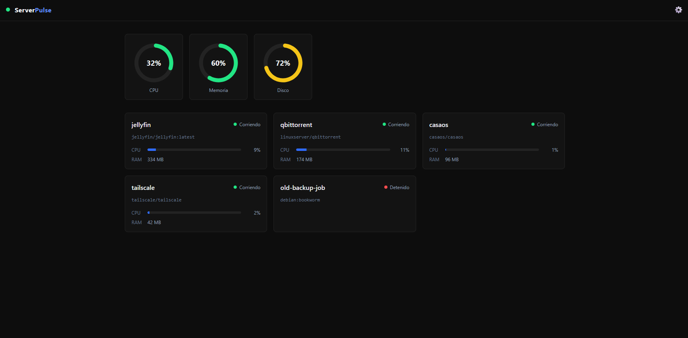

# ServerPulse

Dashboard web standalone para monitorear homelabs Docker: contenedores, métricas del sistema y estado de servicios — sin depender de un backend específico.



## Qué es esto

ServerPulse es un SPA (React + TypeScript + Vite) que se conecta a tu homelab a través de **adaptadores configurables**. El dashboard no sabe ni le importa de dónde vienen los datos — solo conoce una interfaz común (`DataSourceAdapter`), y cada adapter traduce el formato de su backend a los tipos que ServerPulse entiende.

## Los 3 modos de uso

### 1. Con HomeCore API (stack completo recomendado)

[HomeCore API](https://github.com/juanchiappa/homecore-api) es el backend de referencia: una REST API en ASP.NET Core que expone contenedores, servicios y métricas del host vía Docker Engine API.

1. Levantá HomeCore API (ver su propio README para la config de `.env` y `docker compose up`).
2. En ServerPulse, elegí "HomeCore API" como fuente de datos, ingresá la URL (ej: `http://localhost:5000`) y las credenciales de admin configuradas en HomeCore.

### 2. Con Prometheus

Si ya tenés una stack de observabilidad con Prometheus (+ `node_exporter` para métricas de host, y `cAdvisor` para métricas por contenedor), ServerPulse puede consumirlas directo.

1. En ServerPulse, elegí "Prometheus" como fuente de datos e ingresá la URL de tu instancia (ej: `http://localhost:9090`).
2. No requiere login — Prometheus no tiene autenticación propia por default.

> Nota: Prometheus/cAdvisor solo reportan métricas de contenedores que están corriendo — a diferencia de HomeCore API, no vas a ver contenedores detenidos en la lista.

### 3. Datos de prueba (sin backend real)

Para explorar el dashboard sin tener ningún backend levantado, usá el botón **"Usar datos de prueba"** en la pantalla de login. Genera contenedores y métricas simuladas que cambian en cada actualización — útil para desarrollo, demos, o simplemente para ver cómo se ve la interfaz.

## Stack técnico

| Componente | Tecnología |
|---|---|
| Framework | React 18 + TypeScript |
| Build | Vite |
| Estilos | Tailwind CSS v4 |
| Gráficos | Recharts |
| Estado | Zustand |
| Deploy | Docker + nginx |

## Levantar el proyecto

### Con Docker (recomendado)

```bash
docker compose up --build
```

Esto levanta ServerPulse en `http://localhost:8080`. Requiere Docker con soporte de virtualización habilitado en el sistema.

### En modo desarrollo (sin Docker)

```bash
npm install
npm run dev
```

Levanta el servidor de desarrollo de Vite en `http://localhost:5173`, con hot-reload.

## Arquitectura de adaptadores
src/

├── adapters/

│   ├── DataSourceAdapter.ts    # Interfaz común que implementa cada adapter

│   ├── HomeCoreAdapter.ts      # Login JWT + REST contra HomeCore API

│   ├── PrometheusAdapter.ts    # Queries PromQL contra Prometheus

│   ├── MockAdapter.ts          # Datos simulados, solo para desarrollo/testing

│   └── createDataSource.ts     # Factory: arma el adapter correcto según config

├── components/                 # ContainerCard, MetricGauge, SettingsPanel

├── pages/                      # Login, Dashboard

├── store/                      # Estado global (Zustand)

└── types/                      # Tipos de dominio