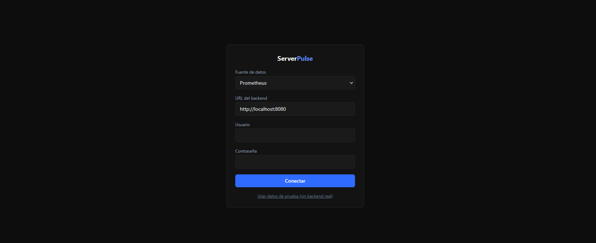

# ServerPulse

Standalone web dashboard for monitoring Docker homelabs: containers, system metrics, and service status — without depending on any specific backend.

It connects through **configurable adapters**: [HomeCore API](https://github.com/juanchiappa/homecore-api), Prometheus, or (coming soon) directly through the Docker socket. You choose the source from the UI itself — no code changes or environment variables required.


## Stack

- React 18 + TypeScript + Vite
- Tailwind CSS v4
- Recharts (metric gauges)
- Zustand (global state)

## The 3 usage modes

ServerPulse is a pure SPA: no matter which backend you pick, everything runs in your browser and the config is stored locally.

### 1. With HomeCore API (recommended full stack)

If you have [HomeCore API](https://github.com/juanchiappa/homecore-api) running in your homelab, select "HomeCore API" on the login screen, enter its URL (e.g. `http://your-server:5000`), and your credentials.

### 2. With Prometheus

If you already run Prometheus (with `node_exporter` and/or `cAdvisor` set up), select "Prometheus" on the login screen and point it to its URL — no username/password required.

### 3. Standalone / demo mode

With no backend running, click **"Use demo data"** on the login screen to explore the dashboard with simulated data. Useful for evaluating the project or for development.



## Getting started

### With Docker (recommended)

```bash
docker compose up --build
```

This starts ServerPulse on `http://localhost:8080`.

### In development mode

```bash
npm install
npm run dev
```

Starts the Vite dev server on `http://localhost:5173` with hot-reload.

## Adapter architecture

The whole project is written against a single interface, `DataSourceAdapter`:

```typescript
interface DataSourceAdapter {
  readonly kind: DataSourceKind
  readonly displayName: string
  fetchSnapshot(): Promise<HomelabSnapshot>
  testConnection(): Promise<ConnectionTestResult>
}
```

Neither the Dashboard, nor the `ContainerCard`, nor the store, know or care whether the data comes from HomeCore, Prometheus, or a mock — each adapter translates its backend's native format into the same domain types (`ContainerInfo`, `SystemMetric`, `ServiceStatus`). Adding a new backend (next up: direct Docker socket) means writing one more adapter, without touching the rest of the app.

## Roadmap

- [x] Project setup and adapter layer
- [x] Functional dashboard with real-time polling
- [x] Second adapter (Prometheus) — validated that the system generalizes
- [x] Settings panel to pick the data source from the UI
- [x] Docker deployment
- [ ] `DockerSocketAdapter` (requires exposing the Docker API over TCP — needs a secure approach)

## License

MIT